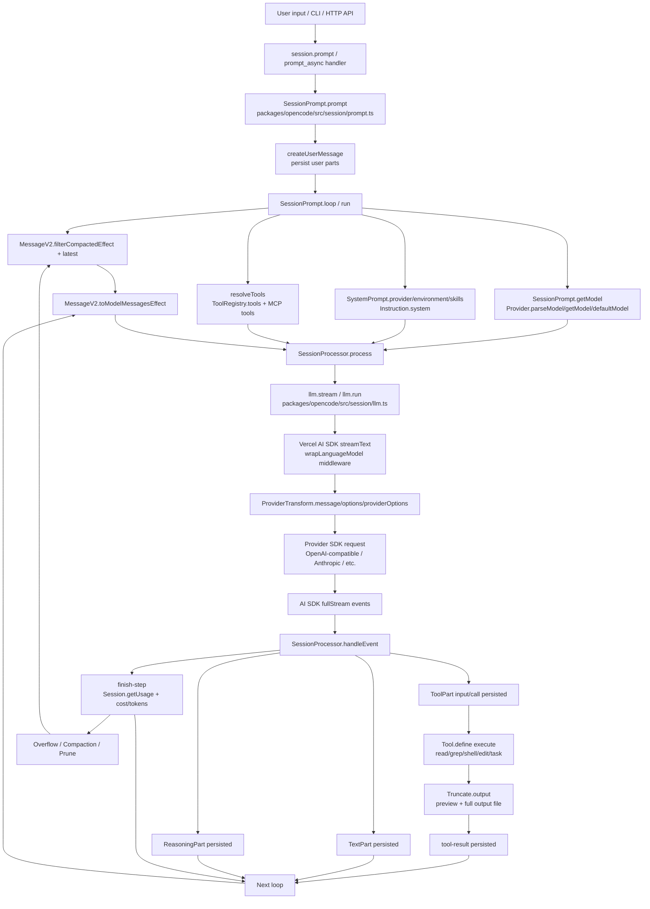

# OpenCode DeepSeek Adaptation And Token Optimization Analysis

分析对象：`/Users/apple/go-project/ai/opencode`

日期：2026-05-17

说明：用户输入中的目录名为 `opencod/`，实际仓库目录为 `opencode/`，本文以实际源码为准。本文只读分析源码；除本归档文件外，不涉及源码改动。

## 1. 项目整体结构

### 根目录与重要配置

根目录关键文件：

- `package.json`：monorepo 根包配置，`packageManager` 为 `bun@1.3.13`。
- `bun.lock` / `bunfig.toml`：Bun 依赖锁定与运行配置。
- `turbo.json`：根 `typecheck` 通过 Turbo 调度。
- `tsconfig.json`：TypeScript 基础配置。
- `sst.config.ts` / `sst-env.d.ts`：SST 相关云资源配置。
- `flake.nix` / `flake.lock` / `nix/`：Nix 环境配置。
- `AGENTS.md`：仓库级代理/协作说明。
- `packages/`：主要源码包。
- `sdks/`：独立 SDK，例如 VS Code SDK。
- `script/`、`install/`、`infra/`、`specs/`：脚本、安装、基础设施和规范资料。

根 `package.json` 关键脚本：

- `dev`：`bun run --cwd packages/opencode --conditions=browser src/index.ts`
- `lint`：`oxlint`
- `typecheck`：`bun turbo typecheck`
- `test`：故意退出，输出 `do not run tests from root`，不能从根目录直接跑全仓测试。

`packages/opencode/package.json` 关键脚本：

- `dev`：`bun run --conditions=browser ./src/index.ts`
- `build`：`bun run script/build.ts`
- `typecheck`：`tsgo --noEmit`
- `test`：`bun test --timeout 30000`
- `test:httpapi`：HTTP API 测试入口。
- CLI bin：`./bin/opencode`

### packages 边界

本次重点与 LLM 主链路直接相关的包：

- `packages/opencode/`：核心 CLI、server、session、provider、tool、agent、config 逻辑。
- `packages/core/`：共享 core 类型/协议，部分 v2 session 类型从这里引入。
- `packages/sdk/js/`：客户端 SDK，CLI run 模式通过 SDK 调 HTTP API。
- `packages/plugin/`：插件体系相关能力。
- `packages/ui/`、`packages/app/`、`packages/web/`、`packages/desktop/`：前端、桌面和 Web 相关。
- `packages/llm/`：模型元数据/LLM 相关共享包。

### opencode CLI / server / session / provider / tool 模块边界

- CLI：
  - `packages/opencode/src/index.ts`：opencode 包入口。
  - `packages/opencode/src/cli/cmd/run.ts`：非交互 run 命令，最终调用 `client.session.prompt(...)`。
  - `packages/opencode/src/cli/cmd/run/runtime.ts`：交互运行时状态、事件处理、权限/问题回复。
  - `packages/opencode/src/cli/cmd/run/stream.transport.ts`：流式传输层，包含 `input.sdk.session.promptAsync(...)`。

- Server / HTTP API：
  - `packages/opencode/src/server/routes/instance/httpapi/server.ts`：HTTP API server layer 装配，提供 `SessionPrompt.defaultLayer`。
  - `packages/opencode/src/server/routes/instance/httpapi/groups/session.ts`：session API schema，包括 `session.prompt`、`session.prompt_async`。
  - `packages/opencode/src/server/routes/instance/httpapi/handlers/session.ts`：HTTP handler 调用 `SessionPrompt.Service.prompt(...)`。
  - `packages/opencode/src/server/routes/instance/httpapi/handlers/v2/session.ts`：v2 session prompt 入口。

- Session：
  - `packages/opencode/src/session/prompt.ts`：用户输入进入 LLM loop 的主编排器。
  - `packages/opencode/src/session/llm.ts`：AI SDK `streamText` 封装，负责 provider/model/options/messages/tools 注入。
  - `packages/opencode/src/session/processor.ts`：消费 LLM stream 事件，持久化 text/reasoning/tool/usage。
  - `packages/opencode/src/session/message-v2.ts`：消息存储结构与 AI SDK `ModelMessage` 转换。
  - `packages/opencode/src/session/compaction.ts`：上下文压缩、tool output prune。
  - `packages/opencode/src/session/overflow.ts`：token overflow 判断。
  - `packages/opencode/src/session/system.ts`：provider prompt、环境信息、skills system prompt。
  - `packages/opencode/src/session/instruction.ts`：AGENTS/CLAUDE/CONTEXT instruction 加载。
  - `packages/opencode/src/session/session.ts`：session 元数据、usage/cost/token 统计。

- Provider：
  - `packages/opencode/src/provider/provider.ts`：provider/model registry、config provider 合并、SDK 加载、model 解析、small model/default model。
  - `packages/opencode/src/provider/transform.ts`：message/options/providerOptions/provider-specific quirks 转换。
  - `packages/opencode/src/config/provider.ts`：用户 provider 配置 schema。

- Tool：
  - `packages/opencode/src/tool/registry.ts`：内置工具、插件工具注册和按 agent/model 过滤。
  - `packages/opencode/src/tool/tool.ts`：工具定义包装器，执行后统一截断输出。
  - `packages/opencode/src/tool/truncate.ts`：工具输出截断与落盘。
  - `packages/opencode/src/tool/read.ts`、`grep.ts`、`edit.ts`、`shell.ts`、`task.ts`：核心工具实现。

## 2. LLM 调用主链路

### 用户输入到模型请求

主要链路：

1. CLI 或 HTTP API 接收用户 prompt。
2. Server handler 或 SDK 调用进入 `SessionPrompt.Service.prompt`。
3. `packages/opencode/src/session/prompt.ts`：
   - `SessionPrompt.prompt` 创建用户消息。
   - `SessionPrompt.loop` 进入 run loop。
   - `SessionPrompt.run` 构造历史消息、system、tools、model、agent、permission。
4. `packages/opencode/src/session/processor.ts`：
   - `SessionProcessor.create(...).process(...)` 调用 `llm.stream(...)`。
   - `handleEvent` 消费 stream 事件并持久化。
5. `packages/opencode/src/session/llm.ts`：
   - `run(...)` 解析 provider SDK、language model、配置、headers、options。
   - 调用 Vercel AI SDK `streamText(...)`。
6. AI SDK full stream 返回：
   - text/reasoning/tool/usage 事件由 `SessionProcessor` 消费。
   - tool call 执行结果写入消息 part。
   - 下一轮 loop 通过 `MessageV2.toModelMessagesEffect(...)` 把历史和 tool result 转为下一次模型上下文。

### 是否使用 Vercel AI SDK `streamText`

是。

关键文件：`packages/opencode/src/session/llm.ts`

- 顶部从 `ai` 引入：`streamText`、`wrapLanguageModel`、`tool`、`jsonSchema`。
- `type Result = Awaited<ReturnType<typeof streamText>>`。
- `run(...)` 内调用 `streamText({ ... })`。
- `stream(...)` 把 `result.fullStream` 包装成 Effect Stream。

### messages / tools / model / provider 如何传入

`packages/opencode/src/session/prompt.ts` 的 `SessionPrompt.run` 准备输入：

- `MessageV2.filterCompactedEffect(sessionID)`：读取并重排压缩后的 session history。
- `MessageV2.latest(msgs)`：找最新 user、assistant、finished assistant、未处理 compaction/subtask。
- `MessageV2.toModelMessagesEffect(msgs, model)`：把持久化消息转为 AI SDK `ModelMessage[]`。
- `resolveTools(...)`：把内部 `Tool.Def` 和 MCP tool 包装成 AI SDK tool。
- `sys.skills(agent)`、`sys.environment(model)`、`instruction.system()`：构建 system prompt 片段。
- 调用 `handle.process({ user, last, agent, permission, sessionID, parentSessionID, system, messages, tools, model, toolChoice })`。

`packages/opencode/src/session/processor.ts`：

- `SessionProcessor.process(...)` 调用 `llm.stream(streamInput)`。
- `streamInput` 原样携带 `model`、`agent`、`system`、`messages`、`tools`、`toolChoice`。

`packages/opencode/src/session/llm.ts`：

- `provider.getLanguage(input.model)` 得到 AI SDK language model。
- `provider.getProvider(input.model.providerID)` 得到 provider config。
- `ProviderTransform.options({ model, sessionID, providerOptions })` 生成 provider options。
- `ProviderTransform.providerOptions(input.model, params.options)` 映射到 AI SDK providerOptions namespace。
- `ProviderTransform.message(args.params.prompt, input.model, options)` 在 middleware 中转换 prompt。
- `streamText({ model: wrapLanguageModel({ model: language, middleware: transformParams }), messages, tools, activeTools, toolChoice, providerOptions, headers, ... })` 发起模型请求。

### stream 事件如何消费和持久化

关键文件：`packages/opencode/src/session/processor.ts`

`SessionProcessor.create` 内的 `handleEvent` 处理 AI SDK stream events：

- `reasoning-start` / `reasoning-delta` / `reasoning-end`：
  - 创建或更新 `ReasoningPart`。
  - reasoning text 被持久化，后续可回放进上下文。

- `text-start` / `text-delta` / `text-end`：
  - 创建或更新 `TextPart`。
  - assistant 文本内容逐步持久化。

- `tool-input-start` / `tool-input-delta` / `tool-call` / `tool-result` / `tool-error`：
  - 创建或更新 `ToolPart`。
  - 工具参数、状态、输出、错误都会落入 session message parts。

- `finish-step`：
  - 调用 `Session.getUsage(...)` 统计 input/output/reasoning/cache token 与 cost。
  - 更新 assistant finish/cost/token 信息。
  - 创建 `step-finish` 事件。
  - 触发 summary/compaction 相关状态。

## 3. Provider 适配逻辑

### Provider 配置如何加载

关键文件：

- `packages/opencode/src/provider/provider.ts`
- `packages/opencode/src/config/config.ts`
- `packages/opencode/src/config/provider.ts`

流程：

1. 内置 provider 通过 `BUNDLED_PROVIDERS` 声明，包含 `@ai-sdk/openai-compatible`、`@ai-sdk/anthropic`、`@ai-sdk/openai` 等。
2. `config.ts` 加载全局、项目、环境变量、managed、`.opencode` 等配置，schema 中包含 `provider`、`model`、`small_model`、`agent`、`permission`、`tool_output`、`compaction`。
3. `provider.ts` 从 models.dev 与用户 `cfg.provider` 合并 provider/model。
4. `fromModelsDevModel(...)` 把 models.dev model 转为内部 `Provider.Model`。
5. 用户配置的 provider/model 会覆盖或扩展内置数据库。

`packages/opencode/src/config/provider.ts` 支持：

- provider 级：`api`、`npm`、`env`、`options.baseURL`、`options.apiKey`、`options.setCacheKey`、`options.timeout`、`options.chunkTimeout`。
- model 级：`id`、`provider`、`name`、`reasoning`、`tool_call`、`modalities`、`limit`、`cost`、`options`、`interleaved`、`variants`。

### model id 如何解析

关键文件：`packages/opencode/src/provider/provider.ts`

- `Provider.parseModel(...)`：从配置或用户输入解析 provider/model 标识。
- `Provider.getModel(...)`：按 providerID/modelID 查找 `Provider.Model`。
- `Provider.defaultModel(...)`：从 `cfg.model`、recent state、provider 列表选默认模型。
- `Provider.getSmallModel(...)`：从 `cfg.small_model` 或优先级列表选择 small model。
- `packages/opencode/src/agent/agent.ts` 在 agent config merge 时调用 `Provider.parseModel(value.model)`。

### OpenAI-compatible / Anthropic-compatible 如何区分

内部核心判断字段是 `Provider.Model.api.npm` 与 `Provider.Model.providerID`：

- OpenAI-compatible：
  - `model.api.npm === "@ai-sdk/openai-compatible"`
  - SDK loader 调用 openai-compatible factory。
  - `Provider.resolveSDK(...)` 对 openai-compatible 默认设置 `includeUsage=true`，除非 provider option 显式关闭。

- Anthropic：
  - `model.api.npm === "@ai-sdk/anthropic"` 或 `@ai-sdk/google-vertex/anthropic`。
  - `ProviderTransform.message(...)` 对 Anthropic/Claude-like provider 走 `applyCaching(...)`。
  - `ProviderTransform.options(...)` 针对 Anthropic 系 provider 设置 `toolStreaming=false` 等差异。

`packages/opencode/src/provider/transform.ts` 中的 `sdkKey(...)` 把 npm 包映射到 AI SDK `providerOptions` namespace，例如：

- `@ai-sdk/openai-compatible`：默认使用 `providerID.split(".")[0]`。
- `@ai-sdk/openai`：`openai`。
- `@ai-sdk/anthropic`：`anthropic`。
- `@openrouter/ai-sdk-provider`：`openrouter`。
- `@ai-sdk/gateway`：`gateway`。

### usage / tool call / reasoning / finishReason 转换

usage：

- `packages/opencode/src/session/session.ts`
- `Session.getUsage(...)` 从 AI SDK `LanguageModelUsage` 和 `ProviderMetadata` 读取：
  - `inputTokens`
  - `outputTokens`
  - `outputTokenDetails.reasoningTokens` 或 `usage.reasoningTokens`
  - `inputTokenDetails.cacheReadTokens` 或 `cachedInputTokens`
  - `inputTokenDetails.cacheWriteTokens`
  - Anthropic/Vertex/Bedrock/Venice metadata fallback
- 当前没有看到对 DeepSeek 原生 `prompt_cache_hit_tokens` / `prompt_cache_miss_tokens` 的显式映射。

tool call：

- `SessionPrompt.resolveTools(...)` 把内部工具包装为 AI SDK `tool({ description, inputSchema, execute })`。
- `SessionProcessor.handleEvent(...)` 消费 `tool-input-*`、`tool-call`、`tool-result`、`tool-error`。
- `MessageV2.toModelMessagesEffect(...)` 回放 assistant tool call 与 tool result。
- `ProviderTransform.normalizeMessages(...)` 对 tool result、tool id、provider-specific content 做兼容清洗。

reasoning：

- `Provider.Model.capabilities.reasoning` 表示模型是否支持 reasoning。
- `Provider.Model.capabilities.interleaved` 支持 `{ field: "reasoning_content" | "reasoning_details" }`。
- `provider.ts` 在 config 扩展新 OpenAI-compatible DeepSeek model 时，如果 `apiID` 包含 `deepseek`，默认设置 `interleaved: { field: "reasoning_content" }`。
- `SessionProcessor` 持久化 reasoning part。
- `MessageV2.toModelMessagesEffect(...)` 在同模型回放 reasoning；若换模型且 reasoning 非空，会把 reasoning 转成 text 回放。

finishReason：

- AI SDK `finish-step` 事件进入 `SessionProcessor`。
- assistant message 的 finish、tokens、cost、step 信息由 `SessionProcessor` 更新。
- overflow/compaction 决策基于 finish 后 usage 与 `Session.Stats`。

## 4. Agent 系统

### Agent 定义

关键文件：

- `packages/opencode/src/agent/agent.ts`
- `packages/opencode/src/config/agent.ts`
- `packages/opencode/src/agent/subagent-permissions.ts`
- prompt 文件：
  - `packages/opencode/src/agent/prompt/explore.txt`
  - `packages/opencode/src/agent/prompt/scout.txt`
  - `packages/opencode/src/agent/prompt/summary.txt`
  - `packages/opencode/src/agent/prompt/title.txt`
  - `packages/opencode/src/agent/prompt/compaction.txt`

`Agent.Info` 是 agent 运行时结构，包含 name、model、mode、permission、tools/options/prompt 等。

默认 agent 在 `agent.ts` 中定义：

- `build`：
  - primary agent。
  - 默认主力执行 agent。
  - 允许较宽工具集。
  - `plan_enter` 默认 allow。

- `plan`：
  - primary agent。
  - 写操作默认严格限制。
  - 仅允许特定计划路径写入，例如 `.opencode/plans/*.md`。

- `general`：
  - subagent。

- `explore`：
  - subagent。
  - 主要用于只读探索。
  - 允许 read/search/bash/web 等，拒绝写类工具。

- `scout`：
  - subagent。
  - 受 `flags.experimentalScout` 控制。

- `compaction` / `title` / `summary`：
  - hidden primary agent。
  - 用于压缩、标题、总结。
  - 工具一般 deny。

### agent 如何选择 model / small_model

关键点：

- `packages/opencode/src/agent/agent.ts`
  - agent 配置合并时，`model` 经 `Provider.parseModel(...)` 解析。
  - `defaultAgent(...)` 根据 `cfg.default_agent` 或默认 `build` 选择主 agent。
  - `Agent.generate(...)` 使用 `generateObject` / `streamObject`，属于非主聊天链路的结构化生成能力。

- `packages/opencode/src/provider/provider.ts`
  - `Provider.defaultModel(...)`：主模型。
  - `Provider.getSmallModel(...)`：small model。

- `packages/opencode/src/session/prompt.ts`
  - `SessionPrompt.getModel(...)` 根据用户输入、agent 配置、session state 解析本轮 model。
  - 标题生成 `ensureTitle(...)` 调 `llm.stream(..., small: true)` 使用 small options/small model 路径。

### agent permission 如何控制 edit / bash / read 等工具

关键文件：

- `packages/opencode/src/config/agent.ts`
- `packages/opencode/src/permission/permission.ts`
- `packages/opencode/src/tool/registry.ts`
- 各工具内部 permission 检查，例如 `read.ts`、`edit.ts`、`shell.ts`。

机制：

- agent config 支持 `permission`，并兼容旧 `tools` 字段到 permission 的迁移。
- `ToolRegistry.tools(...)` 根据 agent/model/provider 过滤工具。
- `Permission.evaluate(toolID, action, agent.permission)` 决定 allow/ask/deny。
- `read.ts` 检查 external/read permission。
- `edit.ts` 在写入前构建 diff 并进入 permission ask。
- `shell.ts` 解析 shell command，结合 permission 决定是否可执行。

### subagent 是否已有路由机制

已有基础 subagent 机制，但不是 DeepSeek V4 Pro / V4 Flash 语义路由器。

现有机制：

- `packages/opencode/src/tool/task.ts`
  - `TaskTool` 允许模型发起子任务。
  - 通过 agent name 选择目标 subagent。
  - 创建或恢复 child session 后调用 `ops.prompt(...)` / `ops.loop(...)`。

- `packages/opencode/src/session/prompt.ts`
  - `SessionPrompt.handleSubtask(...)` 处理 `SubtaskPart`。

- `packages/opencode/src/agent/subagent-permissions.ts`
  - `deriveSubagentSessionPermission(...)` 从 parent session 推导 subagent 权限。
  - 父会话 edit deny、external_directory deny 会传播。
  - `todowrite`、`task` 默认限制，除非 subagent 自身允许。

结论：

- 当前 subagent 路由是“模型调用 TaskTool 并指定 agent name”。
- 没看到基于任务类型自动选择 V4 Pro / V4 Flash 的中心路由器。
- 最小可行做法是通过 `agent.model`、`small_model`、`default_agent` 和 `TaskTool` 描述控制分工。
- 若要做自动任务路由，建议在 `SessionPrompt.getModel(...)` 或 agent 选择层扩展，而不是在 `SessionProcessor` 或 tool 执行层硬改。

## 5. Tool 调用链路

### 工具在哪里注册

关键文件：`packages/opencode/src/tool/registry.ts`

内置工具由 registry 实例化，典型包括：

- `bash` / shell：`packages/opencode/src/tool/shell.ts`
- `grep`：`packages/opencode/src/tool/grep.ts`
- `read`：`packages/opencode/src/tool/read.ts`
- `edit`：`packages/opencode/src/tool/edit.ts`
- `write` / `apply_patch`
- `task`
- `skill`
- web/search 相关工具

插件工具：

- 从插件目录 `{tool,tools}/*.{js,ts}` 动态加载。
- 通过 plugin hook `tool.definition` 修改工具描述/schema。

按模型过滤：

- `ToolRegistry.tools(...)` 中，如果 `modelID` 包含 `gpt-` 且不是 `oss` / `gpt-4`，优先使用 `apply_patch`，隐藏 `edit`/`write`。
- 否则隐藏 `apply_patch`，保留 `edit`/`write`。

### bash / grep / file.read / edit 如何执行

公共包装：

- `packages/opencode/src/tool/tool.ts`
- `Tool.define(...)` 包装工具：
  - 校验参数。
  - 执行 `execute(...)`。
  - 调用 `Truncate.output(...)` 对输出截断。

read：

- `packages/opencode/src/tool/read.ts`
- 支持文本、目录、媒体附件。
- 有读取权限校验。
- 有行数/字节限制。
- 会通过 instruction resolver 自动加载附近 instruction 文件。

grep：

- `packages/opencode/src/tool/grep.ts`
- 使用 ripgrep。
- 限制匹配数量和单行长度。

edit：

- `packages/opencode/src/tool/edit.ts`
- 写入前构造 diff。
- 权限为 ask 时会要求用户确认。
- 写入后可触发格式化和 LSP diagnostics。

shell/bash：

- `packages/opencode/src/tool/shell.ts`
- 解析 shell 命令。
- 结合 permission 和 external directory 等规则控制执行。
- 输出会截断，保留 tail/preview。

task：

- `packages/opencode/src/tool/task.ts`
- 子代理工具。
- 创建/恢复 child session，调用 `SessionPrompt` ops。

### 工具输出如何进入下一轮 LLM 上下文

链路：

1. `streamText` 产生 tool call。
2. `SessionProcessor.handleEvent(...)` 持久化 `ToolPart`。
3. tool execute 返回 `Tool.ExecuteResult`。
4. `Tool.define(...)` 包装器对 output 做 `Truncate.output(...)`。
5. `tool-result` 事件持久化 completed tool output。
6. 下一轮 `MessageV2.toModelMessagesEffect(...)` 把 completed tool output 转成 AI SDK `tool-result`。
7. 若 tool result 已被 compaction prune，会回放 `[Old tool result content cleared]`。
8. 若配置了 `toolOutputMaxChars`，会通过 `truncateToolOutput(...)` 在上下文转换时再次截断。

### 输出截断、摘要、落盘、token budget 控制

已有机制：

- `packages/opencode/src/tool/truncate.ts`
  - 默认 `MAX_LINES=2000`。
  - 默认 `MAX_BYTES=50KB`。
  - 超限时完整输出落盘到 truncation 目录。
  - 返回 preview 与提示，提示可引导用 `Task` 继续处理大输出。

- `packages/opencode/src/session/compaction.ts`
  - `TOOL_OUTPUT_MAX_CHARS=2000`。
  - `prune(...)` 会标记旧 completed tool output 为 compacted。
  - `processCompaction(...)` 给 compaction agent 的上下文会 `stripMedia` 且限制 tool output chars。

- `packages/opencode/src/session/overflow.ts`
  - `usable(...)` 预留 compaction buffer/output tokens。
  - `isOverflow(...)` 比较当前 token 与可用 token。

- `packages/opencode/src/config/config.ts`
  - 配置 schema 包含 `tool_output` 与 `compaction`。

不足：

- 工具输出主要是“截断/落盘”，不是结构化摘要。
- 对 DeepSeek prompt cache 来说，大量动态 tool result 位于尾部是合理的，但稳定 system 前缀仍有进一步优化空间。

## 6. 上下文构造逻辑

### system prompt / instructions / AGENTS.md / history / tool result 拼接

system prompt 来源：

- `packages/opencode/src/session/system.ts`
  - `SystemPrompt.provider(model)`：按 model/provider 选择 provider-specific prompt。
  - `SystemPrompt.environment(model)`：生成环境块，包括 model id、cwd、worktree、git、platform、date。
  - `SystemPrompt.skills(agent)`：当 agent 允许 skill 时，把 skills 列表加入 system。

- `packages/opencode/src/session/instruction.ts`
  - instruction 文件名：`AGENTS.md`、`CLAUDE.md`、`CONTEXT.md`。
  - `systemPaths(...)`：选择全局/项目/config instructions。
  - `system(...)`：返回 `Instructions from: path\ncontent`。
  - `resolve(...)`：读取文件时按路径补充 nearby instructions，并避免同一消息重复加载。

LLM 请求时的拼接：

- `packages/opencode/src/session/llm.ts`
  - `system` 第一个元素由 agent prompt 或 provider prompt、`input.system`、`input.user.system` 拼接。
  - 触发 `experimental.chat.system.transform` 插件 hook。
  - 如果插件扩展后仍保留原 header，则重组为两段 system，用于缓存结构稳定。
  - 非 OpenAI OAuth / workflow 情况下，最终 `messages = system messages + input.messages`。

history 与 tool result：

- `packages/opencode/src/session/message-v2.ts`
  - `MessageV2.toModelMessagesEffect(...)` 把 session history 转成 AI SDK `ModelMessage[]`。
  - user parts、assistant text、assistant reasoning、tool call、tool result 都在这里回放。
  - completed tool result 若 compacted，则替换为 `[Old tool result content cleared]`。
  - reasoning 若同模型可回放；换模型时会转成 text。

### compaction / prune / summary 机制

关键文件：

- `packages/opencode/src/session/compaction.ts`
- `packages/opencode/src/session/overflow.ts`
- `packages/opencode/src/session/message-v2.ts`

机制：

- `overflow.ts` 判断 token 是否超过可用上下文。
- `compaction.ts` 定义：
  - `PRUNE_MINIMUM=20000`
  - `PRUNE_PROTECT=40000`
  - `TOOL_OUTPUT_MAX_CHARS=2000`
  - `DEFAULT_TAIL_TURNS=2`
- `select(...)` 保留最近 tail turns 与预算内消息。
- `prune(...)` 标记旧 tool output compacted。
- `processCompaction(...)`：
  - 使用 compaction agent/model。
  - 调 `MessageV2.toModelMessagesEffect(..., { stripMedia: true, toolOutputMaxChars: TOOL_OUTPUT_MAX_CHARS })`。
  - 工具禁用：`tools: {}`。
  - 将压缩 prompt 作为追加 user message 发给 compaction agent。
  - 自动压缩后可 replay last user message。

### 稳定前缀与动态尾部

相对稳定：

- provider prompt：`SystemPrompt.provider(model)`。
- agent prompt：agent config 中的 `prompt`。
- 项目级 AGENTS/CLAUDE/CONTEXT instructions：内容不频繁变化，但路径和项目不同会变。
- skills/tool definitions：agent 和插件不变时稳定。

中等稳定：

- `SystemPrompt.environment(model)` 中的 cwd/worktree/git/platform/model。
- 其中 date/time 属于动态字段，会影响缓存命中。
- instruction resolver 动态附加的 nearby instructions，取决于读取过的文件路径。

动态尾部：

- session history。
- 最新 user prompt。
- assistant text/reasoning。
- tool call/tool result。
- permission/question 相关状态。
- compaction summary 与 replay 消息。

### 是否适合做 DeepSeek prompt cache 命中优化

适合，但要改在正确层次。

当前已有缓存友好基础：

- `llm.ts` 尝试保持 system 两段结构，注释中明确用于 caching。
- `ProviderTransform.applyCaching(...)` 已对 Anthropic-like provider 标记前两个 system 与最后两个 non-system message。
- `ProviderTransform.options(...)` 已对 OpenAI/Azure/OpenRouter/Gateway/Venice 等设置 cache key 或 gateway caching。
- `Session.getUsage(...)` 已有 cache read/write token 统计槽位。

DeepSeek 需要补齐：

- DeepSeek prompt cache hit/miss token 字段映射到 `Session.getUsage(...)`。
- 确认 DeepSeek OpenAI-compatible 是否支持 AI SDK providerOptions 级 cache 控制；如果只返回 usage，不需要改 message body。
- 减少 system 前缀中 date/time 等动态字段对缓存前缀的污染。
- 把频繁变化的环境/上下文移动到后段 system 或动态尾部，但不能破坏现有 agent 行为。

## 7. DeepSeek 二开相关风险点

### reasoning_content 是否被保留和回传

当前代码具备基础能力：

- `Provider.Model.capabilities.interleaved` 支持 `reasoning_content`。
- `provider.ts` 对新配置的 OpenAI-compatible DeepSeek model 默认 `interleaved: { field: "reasoning_content" }`。
- `SessionProcessor` 持久化 reasoning stream events。
- `MessageV2.toModelMessagesEffect(...)` 会同模型回放 reasoning。

风险：

- 是否真正收到 reasoning event 取决于 `@ai-sdk/openai-compatible` 对 DeepSeek `reasoning_content` 的解析。
- 如果 AI SDK 没把 `reasoning_content` 转成 `reasoning-*` event，需要在 provider SDK、middleware、或 fetch/stream 解析层补适配。
- 换模型时 reasoning 会转 text，DeepSeek V4 Pro/Flash 混跑时要确认这不会污染下一轮模型行为。

### prompt_cache_hit_tokens / prompt_cache_miss_tokens 是否能采集

当前没有看到显式支持。

已有映射：

- `inputTokenDetails.cacheReadTokens`
- `usage.cachedInputTokens`
- `inputTokenDetails.cacheWriteTokens`
- Anthropic/Vertex/Bedrock/Venice metadata fallback。

风险：

- DeepSeek 可能返回 `prompt_cache_hit_tokens` / `prompt_cache_miss_tokens`，不会自动落入上述标准字段。
- 需要确认 AI SDK openai-compatible 是否把这些字段归一化；若没有，需要在 `Session.getUsage(...)` 或 provider metadata 提取层补充。

建议映射：

- `prompt_cache_hit_tokens` -> `tokens.cache.read`
- `prompt_cache_miss_tokens` 是否映射为 write 要谨慎。DeepSeek miss 表示未命中输入，不一定等价 cache write。成本统计可单独记录 miss，计费输入仍应按非缓存 input 处理。

### tool_calls 多轮请求是否兼容 DeepSeek

当前链路支持多轮 tool call：

- AI SDK tool call -> `SessionProcessor` 持久化 -> 工具执行 -> tool result -> 下一轮 `MessageV2.toModelMessagesEffect(...)` 回放。
- `ProviderTransform.options(...)` 对 OpenAI-compatible DeepSeek 设置 `parallelToolCalls=true`。

风险：

- DeepSeek 对 tool call id、arguments partial streaming、parallel tool calls 的兼容性需要实测。
- `ProviderTransform.normalizeMessages(...)` 已有大量 provider quirk，DeepSeek 如果对 assistant/tool message 角色顺序严格，可能需要新增 DeepSeek 分支。
- 大工具输出虽然会截断，但仍可能影响 DeepSeek tool follow-up 的稳定性。

### thinking / reasoning_effort 参数在哪里注入最合适

优先层级：

1. 用户配置：`provider.models.<model>.options` 或 agent `options`。
2. `ProviderTransform.options(...)`：按 provider/model 自动注入默认 thinking/reasoning 参数。
3. `ProviderTransform.providerOptions(...)`：只负责映射 namespace，不建议放业务判断。
4. `llm.ts`：只做通用 streamText 装配，不建议直接写 DeepSeek 分支，除非 AI SDK middleware 必须截获原始 prompt/params。

结论：

- DeepSeek V4 reasoning/thinking 默认参数应放在 `packages/opencode/src/provider/transform.ts` 的 `options(...)`。
- 用户可覆盖的模型差异放在 `packages/opencode/src/config/provider.ts` schema 已支持的 `options` / `variants`。

### V4 Pro / V4 Flash 任务路由应该改哪一层

最小方案：

- 配置层：
  - `model` 指向 DeepSeek V4 Pro。
  - `small_model` 指向 DeepSeek V4 Flash。
  - `agent.title`、`agent.summary`、`agent.compaction` 使用 Flash。
  - `agent.build` / 高风险 `plan` 使用 Pro。

源码扩展方案：

- `packages/opencode/src/agent/agent.ts`：扩展默认 agent 或 agent metadata。
- `packages/opencode/src/session/prompt.ts`：在 `SessionPrompt.getModel(...)` 或 run loop agent/model 选择处加入任务类型到模型的路由。
- `packages/opencode/src/tool/task.ts`：TaskTool 描述可增强，让主模型更稳定地把 explore/summary/scout 交给 Flash agent。
- `packages/opencode/src/provider/provider.ts`：完善 `getSmallModel(...)` 优先级，让 Flash 被稳定选中。

不建议：

- 不建议在 `SessionProcessor` 做路由，它只应消费 stream。
- 不建议在具体 tool 执行层做模型选择。

## 8. 调用链图

## 9. 关键文件清单

| 领域 | 文件 | 关键函数/类型 |
| --- | --- | --- |
| CLI run | `packages/opencode/src/cli/cmd/run.ts` | `client.session.prompt(...)` |
| CLI runtime | `packages/opencode/src/cli/cmd/run/runtime.ts` | prompt queue、permission/question handling |
| HTTP API | `packages/opencode/src/server/routes/instance/httpapi/handlers/session.ts` | `promptSvc.prompt(...)` |
| API schema | `packages/opencode/src/server/routes/instance/httpapi/groups/session.ts` | `PromptPayload` |
| Session 主编排 | `packages/opencode/src/session/prompt.ts` | `SessionPrompt.prompt`、`runLoop`、`resolveTools`、`getModel`、`handleSubtask` |
| LLM 调用 | `packages/opencode/src/session/llm.ts` | `StreamInput`、`run`、`stream`、`streamText` |
| Stream 消费 | `packages/opencode/src/session/processor.ts` | `SessionProcessor.create`、`process`、`handleEvent` |
| Message 转换 | `packages/opencode/src/session/message-v2.ts` | `toModelMessagesEffect`、`filterCompactedEffect`、`latest`、`truncateToolOutput` |
| Provider registry | `packages/opencode/src/provider/provider.ts` | `fromModelsDevModel`、`resolveSDK`、`getModel`、`getLanguage`、`getSmallModel`、`defaultModel` |
| Provider transform | `packages/opencode/src/provider/transform.ts` | `message`、`normalizeMessages`、`applyCaching`、`variants`、`options`、`smallOptions`、`providerOptions` |
| Usage/cost | `packages/opencode/src/session/session.ts` | `getUsage` |
| Agent | `packages/opencode/src/agent/agent.ts` | `Agent.Info`、default agents、`defaultAgent`、`generate` |
| Agent config | `packages/opencode/src/config/agent.ts` | agent config schema、permission normalization |
| Subagent permission | `packages/opencode/src/agent/subagent-permissions.ts` | `deriveSubagentSessionPermission` |
| Tool registry | `packages/opencode/src/tool/registry.ts` | builtin/plugin tools、`tools` |
| Tool wrapper | `packages/opencode/src/tool/tool.ts` | `Tool.define`、`ExecuteResult` |
| Tool truncation | `packages/opencode/src/tool/truncate.ts` | `Truncate.output` |
| Tool read | `packages/opencode/src/tool/read.ts` | file/dir/media read、instruction auto-load |
| Tool grep | `packages/opencode/src/tool/grep.ts` | ripgrep wrapper |
| Tool edit | `packages/opencode/src/tool/edit.ts` | diff permission、write、format、diagnostics |
| Tool shell | `packages/opencode/src/tool/shell.ts` | command parsing、permission、execution |
| Tool task | `packages/opencode/src/tool/task.ts` | subagent session creation/resume |
| System prompt | `packages/opencode/src/session/system.ts` | `provider`、`environment`、`skills` |
| Instructions | `packages/opencode/src/session/instruction.ts` | `systemPaths`、`system`、`resolve` |
| Compaction | `packages/opencode/src/session/compaction.ts` | `select`、`prune`、`processCompaction` |
| Overflow | `packages/opencode/src/session/overflow.ts` | `usable`、`isOverflow` |
| Config | `packages/opencode/src/config/config.ts` | config schema/loading |
| Provider config | `packages/opencode/src/config/provider.ts` | provider/model schema |

## 10. 当前代码中最适合二开的扩展点

优先扩展点：

1. `packages/opencode/src/provider/transform.ts`
   - DeepSeek request options、reasoning/thinking 参数、parallel tool call、providerOptions mapping。
   - 最适合放 provider-specific 默认行为。

2. `packages/opencode/src/provider/provider.ts`
   - DeepSeek provider/model 默认能力。
   - `interleaved: { field: "reasoning_content" }` 已有 DeepSeek 默认逻辑。
   - SDK 加载、`includeUsage`、baseURL/apiKey/timeout/chunkTimeout。

3. `packages/opencode/src/session/session.ts`
   - usage/cost/token 统计。
   - DeepSeek prompt cache hit/miss token 最适合在 `getUsage(...)` 汇总。

4. `packages/opencode/src/config/provider.ts`
   - 如果新增 DeepSeek 专属配置字段，需要先扩 schema。
   - 但已有 `options`、`variants`、`interleaved`，短期可能无需扩 schema。

5. `packages/opencode/src/agent/agent.ts` 与 `packages/opencode/src/config/agent.ts`
   - V4 Pro / V4 Flash agent 分工。
   - 默认 agent 和用户配置合并。

6. `packages/opencode/src/session/prompt.ts`
   - 任务路由、agent/model 决策。
   - 这是高风险扩展点，只在配置无法满足动态路由时改。

7. `packages/opencode/src/session/compaction.ts`
   - token 优化、摘要策略、tool output prune 策略。

8. `packages/opencode/src/tool/truncate.ts`
   - 工具输出 token 控制、摘要提示、落盘提示。

插件扩展点：

- `experimental.chat.system.transform`
- `chat.params`
- `chat.headers`
- `tool.definition`

如果只是验证 DeepSeek 参数或缓存策略，优先通过插件或 provider config 实验，再固化到源码。

## 11. 不建议直接修改的核心区域

| 区域 | 不建议原因 | 替代方案 |
| --- | --- | --- |
| `packages/opencode/src/session/processor.ts` | stream 事件持久化核心，改错会破坏 text/reasoning/tool/usage 全链路 | 先在 provider transform / usage mapping 适配 |
| `packages/opencode/src/session/message-v2.ts` | 历史消息回放与 compaction 兼容核心，影响所有 provider | 只在有明确 DeepSeek message 兼容 bug 时做小分支 |
| `packages/opencode/src/session/llm.ts` | 通用 AI SDK 调用封装，所有 provider 共用 | 优先用 `ProviderTransform`、provider config、plugin hook |
| `packages/opencode/src/tool/tool.ts` | 所有工具执行包装器 | 优先改具体工具或 `tool/truncate.ts` |
| `packages/opencode/src/tool/registry.ts` | 工具集合和模型过滤策略核心 | 除非要新增工具路由，否则避免改 |
| `packages/opencode/src/provider/provider.ts` 的 SDK loader 主体 | 影响所有 provider 初始化/auth/fetch | DeepSeek 尽量通过 config/model/options 扩展 |
| `packages/opencode/src/session/compaction.ts` 的消息选择算法 | 容易造成历史丢失或重复 replay | 先增加配置化参数和指标，再调整算法 |

## 12. DeepSeek 适配最小改动方案

目标：在不重写 session/tool/processor 的前提下，完成 DeepSeek OpenAI-compatible 可用、reasoning 可保留、usage/cache 可统计、V4 Pro/Flash 可配置分工。

### Phase 1：配置优先验证

预计改动文件：

- 用户配置文件或测试 fixture，不一定需要改源码。
- 可选新增文档：DeepSeek provider 示例配置。

内容：

- 配置 provider：
  - `npm: "@ai-sdk/openai-compatible"`
  - `api/baseURL`
  - `apiKey/env`
  - `models.deepseek-v4-pro`
  - `models.deepseek-v4-flash`
  - `reasoning: true`
  - `tool_call: true`
  - `interleaved: { field: "reasoning_content" }`
  - `options` 中放 DeepSeek thinking/reasoning 参数。
- 配置 `model` 为 Pro，`small_model` 为 Flash。
- agent config 中将 `title`、`summary`、`compaction` 指向 Flash，`build` 指向 Pro。

### Phase 2：DeepSeek 默认请求参数

预计改动文件：

- `packages/opencode/src/provider/transform.ts`

改动点：

- 在 `options(...)` 中增加 DeepSeek V4 系列识别。
- 根据模型名/capabilities 注入 DeepSeek 所需 thinking/reasoning 参数。
- 保留用户 `model.options` / `agent.options` 覆盖能力。
- 维持当前 `parallelToolCalls=true`。

注意：

- 不要把 DeepSeek 分支写进 `llm.ts`。
- 不要在 `providerOptions(...)` 中放业务判断，那里只负责 namespace。

### Phase 3：DeepSeek cache usage 采集

预计改动文件：

- `packages/opencode/src/session/session.ts`
- 可选：`packages/opencode/src/provider/transform.ts` 或 provider metadata 相关类型定义。

改动点：

- 在 `Session.getUsage(...)` 中识别 DeepSeek/openai-compatible metadata 或 raw usage：
  - `prompt_cache_hit_tokens`
  - `prompt_cache_miss_tokens`
- `prompt_cache_hit_tokens` 映射到 `tokens.cache.read`。
- `prompt_cache_miss_tokens` 建议先单独记录或作为非缓存 input 的校验，不要直接等同 cache write。
- 如 UI/统计需要展示 miss，需要扩 session token schema。

### Phase 4：reasoning_content 验证与 fallback

预计改动文件：

- 优先无源码改动，用 fixture/HTTP recorder 验证。
- 如 AI SDK 不产生 reasoning events：
  - `packages/opencode/src/provider/provider.ts`：provider SDK/fetch 层 metadata 或 stream 适配。
  - 或新增专用 OpenAI-compatible wrapper。

验证点：

- DeepSeek reasoning 是否进入 `reasoning-start/delta/end`。
- `MessageV2.toModelMessagesEffect(...)` 下一轮是否能正确回放。
- Pro/Flash 混跑时 reasoning 转 text 是否可接受。

## 13. Token 优化后续改造方案

### 方案 A：稳定前缀拆分与 DeepSeek cache 命中优化

目标：

- 最大化 system/provider/instruction 稳定前缀命中。
- 降低 date/cwd/session/tool 动态内容污染 prefix cache。

预计改动文件：

- `packages/opencode/src/session/llm.ts`
- `packages/opencode/src/session/system.ts`
- `packages/opencode/src/provider/transform.ts`
- `packages/opencode/src/session/session.ts`

建议：

- 将 provider/agent base prompt 与项目 instructions 保持在 system 前段。
- 将 `environment(model)` 中动态字段拆到后段 system 或普通动态 message。
- DeepSeek 如果不支持 message-level cache control，则重点保证消息序列前缀完全稳定。
- 在 `Session.getUsage(...)` 中记录 hit/miss，建立回归指标。

风险：

- system prompt 顺序变化可能影响模型行为。
- 需要用真实 DeepSeek 请求比较 cache hit 和回答质量。

### 方案 B：工具输出结构化摘要

目标：

- 大工具输出不再只截断，而是提供结构化摘要 + 可追溯落盘路径。

预计改动文件：

- `packages/opencode/src/tool/truncate.ts`
- `packages/opencode/src/tool/read.ts`
- `packages/opencode/src/tool/grep.ts`
- `packages/opencode/src/session/message-v2.ts`
- 可选：`packages/opencode/src/config/config.ts`

建议：

- read/grep 输出增加机器可读 summary：
  - 文件数、匹配数、行号范围、是否截断。
  - full output artifact id/path。
- `MessageV2.toModelMessagesEffect(...)` 对旧 tool result 优先回放 summary，不回放大块 preview。
- 配置化不同工具的上下文预算。

风险：

- 模型可能依赖原始输出细节。
- 需要确保用户可要求继续读取完整内容。

### 方案 C：Compaction 策略细化

目标：

- 更早 prune 大 tool result。
- 更稳定保留任务目标、已确认事实、未完成 TODO。

预计改动文件：

- `packages/opencode/src/session/compaction.ts`
- `packages/opencode/src/session/message-v2.ts`
- `packages/opencode/src/config/config.ts`
- `packages/opencode/src/agent/prompt/compaction.txt`

建议：

- 按 part 类型分配预算：user intent > final tool facts > raw output。
- compaction prompt 强制输出结构化字段：
  - objective
  - decisions
  - files touched/read
  - pending tasks
  - constraints
- 对旧 completed tool output 默认 prune，只保留 summary。

风险：

- 压缩摘要质量直接影响后续任务。
- 需要针对长会话回放测试。

### 方案 D：V4 Pro / V4 Flash 任务路由

目标：

- Pro 负责复杂推理、代码修改、最终判断。
- Flash 负责 title、summary、compaction、简单 explore/scout、低风险工具结果整理。

预计改动文件：

- `packages/opencode/src/agent/agent.ts`
- `packages/opencode/src/config/agent.ts`
- `packages/opencode/src/session/prompt.ts`
- `packages/opencode/src/tool/task.ts`
- `packages/opencode/src/provider/provider.ts`

建议：

- 第一阶段用配置完成：
  - `small_model = deepseek-v4-flash`
  - hidden agents 用 Flash。
  - `build` 用 Pro。
- 第二阶段如需自动路由：
  - 在 agent/model 选择层增加 task classifier。
  - 不要让 tool 层决定模型。
  - TaskTool 描述中明确各 subagent 适用场景。

风险：

- 跨模型 reasoning/history 回放可能改变行为。
- Flash 处理 compaction 时若摘要损失，会影响 Pro 后续质量。

### 方案 E：Token/Cache 观测面板与回归测试

目标：

- 每次请求能看到 input/output/reasoning/cache hit/cache miss。
- 为后续优化建立量化反馈。

预计改动文件：

- `packages/opencode/src/session/session.ts`
- `packages/opencode/src/session/processor.ts`
- `packages/opencode/src/server/routes/instance/httpapi/groups/session.ts`
- `packages/opencode/src/server/routes/instance/httpapi/handlers/session.ts`
- 前端/CLI 展示相关文件，视 UI 入口而定。

建议：

- 先扩内部 token stats，再扩 API/UI。
- 对 DeepSeek cache miss 单独统计，避免混入 cache write 成本。
- 增加 fixture 测试：同一稳定 prompt 连续两次请求，第二次 hit 上升。

## 14. 推荐拆任务顺序

1. DeepSeek 配置验证
   - 文件：用户 config / 示例文档。
   - 目标：Pro/Flash 能发起请求、tool call 正常、usage 返回。

2. DeepSeek usage/cache 映射
   - 文件：`packages/opencode/src/session/session.ts`。
   - 目标：采集 hit/miss/read tokens。

3. DeepSeek reasoning/thinking 参数
   - 文件：`packages/opencode/src/provider/transform.ts`。
   - 目标：V4 Pro reasoning 可控，Flash 不产生多余 thinking。

4. Agent 配置化路由
   - 文件：配置优先；必要时 `agent.ts`、`provider.ts`。
   - 目标：hidden/small tasks 走 Flash，build 走 Pro。

5. 稳定前缀与 cache 优化
   - 文件：`llm.ts`、`system.ts`、`transform.ts`。
   - 目标：提高 DeepSeek prompt cache 命中。

6. 工具输出摘要与 compaction 优化
   - 文件：`truncate.ts`、`message-v2.ts`、`compaction.ts`。
   - 目标：降低长会话动态尾部 token。

## 15. 当前结论

- 当前 OpenCode 主链路已经高度集中在 `SessionPrompt -> SessionProcessor -> llm.stream -> streamText -> SessionProcessor.handleEvent -> MessageV2.toModelMessagesEffect`。
- Vercel AI SDK `streamText` 是唯一主聊天流式调用核心。
- Provider 二开最合适入口是 `provider/transform.ts` 与 `provider/provider.ts`，usage 统计入口是 `session/session.ts`。
- DeepSeek reasoning_content 已有 schema 和默认 interleaved 支持，但真实保留效果取决于 AI SDK openai-compatible 是否转成 reasoning events。
- DeepSeek prompt cache hit/miss 当前需要补映射。
- 工具输出已有截断、落盘、compaction prune，但缺少结构化摘要和 DeepSeek cache 指标闭环。
- V4 Pro / V4 Flash 路由优先通过配置和 agent model/small_model 实现；自动语义路由再考虑改 `SessionPrompt.getModel(...)` 或 agent 选择层。
